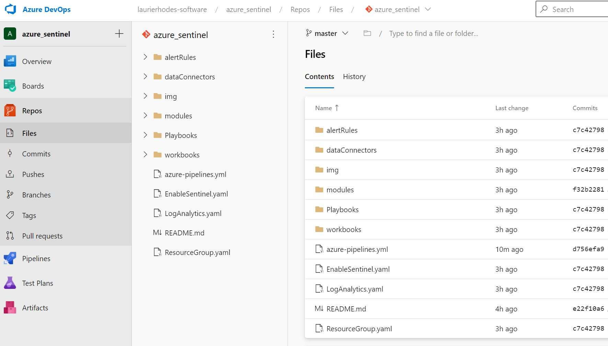
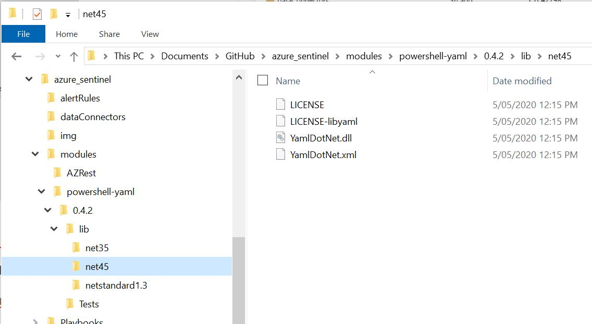
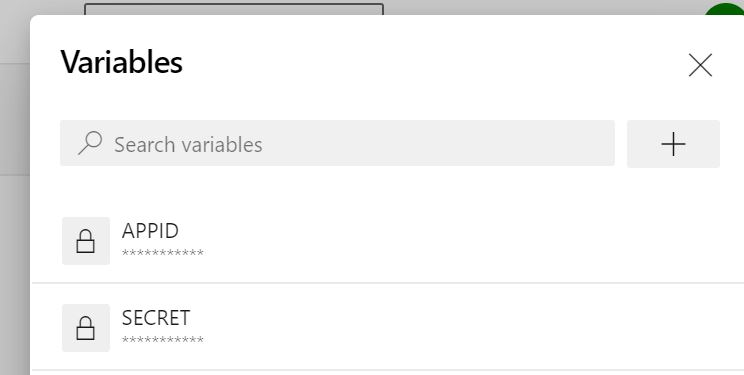

# Azure DevOps - Using YAML Modules 
This example demonstrates using YAML templates for provisioning an Azure Sentinel environment.  Azure DevOps pipelines are YAML based (as shown later in this page).  Using YAML templates for Azure objects  standardises Microsoft's approach for Infrastructure as Code.

The example will use Sentinel from the templates directory in this Repo.



Note that a 'modules' directory contains the two PowerShell modules required by this process. - AZRest &  powershell-yaml. 

[..\modules\powershell]: ..\modules\powershell	"Readme for Installing PowerShell Modules"

The powershell-yaml module will install 'YAML Dot Net' upon first use.  This dll is not included with the powershell-yaml module on this site - you will need to initialise the module on a Windows workstation get get that dependency prior to copying the folder into the modules area of this repo.  After using the module for the first time you'll see the downloaded YamlDotNet.dll 




### Pipeline Variables

Two 'secret' variables are also set as part of the Azure Devops project.  This is to keep sensitive material out of the plain text pipeline.




### **Example Pipeline**

The Pipeline below will deploy a new Sentinel Repository.

```powershell
trigger:
- master

pool:
  vmImage: "vs2017-win2016"

steps:
- task: CopyFiles@2
  inputs:
    Contents: '**'
    TargetFolder: '$(build.artifactstagingdirectory)'
    CleanTargetFolder: true

- task: PowerShell@2
  inputs:
    targetType: 'inline'
    script: |
      # Write your PowerShell commands here.
      Import-Module $(build.artifactstagingdirectory)\modules\AZRest\AZRest.psm1
      Import-Module $(build.artifactstagingdirectory)\modules\powershell-yaml\0.4.2\powershell-yaml.psm1

      # Get an authorised Azure Header
      $authHeader = Get-Header -scope "azure"  -Tenant "laurierhodes.info" -AppId $(AppId) -secret $(Secret)

      # Retrieve an up to date list of namespace versions (once per session)
      if (!$AzAPIVersions){$AzAPIVersions = Get-AzureAPIVersions -header $authHeader -SubscriptionID "2be53ae5-6e46-47df-beb9-6f3a795387b8"}

      # Deploy a Sentinel Environment from templates
      Get-Yamlfile -Path "$(build.artifactstagingdirectory)\ResourceGroup.yaml" | Push-Azureobject -AuthHeader $authHeader -Apiversions $AzAPIVersions
      Get-Yamlfile -Path "$(build.artifactstagingdirectory)\LogAnalytics.yaml" | Push-Azureobject -AuthHeader $authHeader -Apiversions $AzAPIVersions
      Get-Yamlfile -Path "$(build.artifactstagingdirectory)\EnableSentinel.yaml" | Push-Azureobject -AuthHeader $authHeader -Apiversions $AzAPIVersions

  env:
    APPID: $($env:APPID) # the recommended way to map to an env variable
    SECRET: $($env:SECRET) # the recommended way to map to an env variable
```


