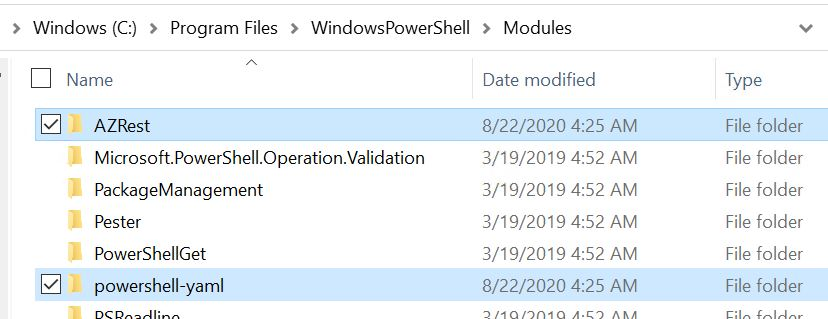

# Azure-YAML Installation 
**Introduction**

Azure objects can be represented in different formats.  Translating Azure objects into PowerShell Hashtables and storing them as YAML is a logical approach for provisioning and managing Azure.

All Azure objects are provisioned with a corresponding provider (i.e. /providers/*Microsoft.Compute*/) that manages REST API calls for creating, modifying and deleting objects of that specific type.  Because the Object ID is structured, the ID states what type of object is specified. the Subscription and Resource Group it resides in, and its name.  If we know the provider name and can work out the current API version. that Id strings is all that is required for accessing (and provisioning) an Azure object through REST.

Creating a lookup table of Azure providers to versions is extremely simple.  The 'powershell-yaml' module for translating PowerShell to YAML is well used by everyone including Microsoft.  With a slight modification the module may be used for directly working with Microsoft's Azure providers.

A second module (AZRest) is included in this repository that demonstrates how to authenticate to Azure and get objects from the cloud.


## **Required Modules**

### 'powershell-yaml' - with modification

A forked version of powershell-yaml is available for download here:

https://github.com/LaurieRhodes/powershell-yaml/releases/download/datemod/powershell-yaml.zip

Download a copy of the zip file.

*<u>Modification description</u>*

The installed module will be found at "C:\Program Files\WindowsPowerShell\Modules\powershell-yaml"

The official version (0.4.2) does not natively support overriding the automatic detection of data types, which is a fundamental problem for the version field with ARM templates.  This modified fork of the '*powershell-yaml.psm1*' file has been amended as:

Line 84: (original) function - Convert-ValueToProperType

```powershell
  if([Text.RegularExpressions.Regex]::IsMatch($Node.Value, $regex, [Text.RegularExpressions.RegexOptions]::IgnorePatternWhitespace) ) {
        [DateTime]$datetime = [DateTime]::MinValue
        if( ([DateTime]::TryParse($Node.Value,[ref]$datetime)) ) {
            return $datetime
        }
    }
```

The updated function is below with a final "if statement"... if the date sequence is enclosed in single or double quotes (which is the style property), return the string value and not DateTime:

```powershell
    if([Text.RegularExpressions.Regex]::IsMatch($Node.Value, $regex, [Text.RegularExpressions.RegexOptions]::IgnorePatternWhitespace) ) {
        [DateTime]$datetime = [DateTime]::MinValue
        if( ([DateTime]::TryParse($Node.Value,[ref]$datetime)) ) {
            if ($Node.Style -in 'DoubleQuoted','SingleQuoted') {
                return $Node.Value
            }
            else {
                return $datetime
            }
        }
    }
```


### AZRest (this Repo)

A forked version of powershell-yaml is available for download here:

https://github.com/LaurieRhodes/azure-yaml/releases/download/x64/AZRest.zip

Download a copy of the zip file.

## Install Instructions

Extract both zipped modules to the directory 'C:\Program Files\WindowsPowerShell\Modules'

https://github.com/LaurieRhodes/powershell-yaml/releases/download/datemod/powershell-yaml.zip

https://github.com/LaurieRhodes/azure-yaml/releases/download/x64/AZRest.zip

Hint * Use an application like 7Zip for extracting archives.  The native Windows zip extraction makes every files as coming from the Internet, meaning each needs to be touched prior to them being used.





These files will be natively imported when new PowerShell sessions are started.  You may be required to manually import the modules

```powershell
Import-Module AZRest
Import-Module powershell-yaml
```


## *Example YAML Install Script*

The example below demonstrates the deployment of YAML files into Azure.  

Note that Id entries for objects must be set prior to deployment.  Note the templates folder and subsequent Readme for further details.

```powershell
# Optional import of modules
# Import-Module "C:\Scripts\AZRest\1.0\powershell-yaml\0.4.2\powershell-yaml.psm1" 
# Import-Module "C:\Scripts\AZRest\1.0\AZRest\AZRest.psm1" 


# Get an authorised Azure Header for REST
$authHeader = Get-Header -scope "azure"  -Tenant "laurierhodes.info" -AppId "aa73b052-6cea-4f17-b54b-6a536be5c722" -secret 'XXXXXXXXXXXXXXXXXXXXXXXXX’ 


# Retrieve an up to date list of API versions (once per session) - note that any subscription may be used for generating a current API versions file.

if (!$AzAPIVersions){$AzAPIVersions = Get-AzureAPIVersions -header $authHeader -SubscriptionID "2be53ae5-6e46-47df-beb9-6f3a795387b8"}


# Create a Sentinel space

$path  = "C:\Scripts\yaml"
Get-Yamlfile -Path "$path\Sentinel\ResourceGroup.yaml" | Push-Azureobject -AuthHeader $authHeader -Apiversions $AzAPIVersions 
Get-Yamlfile -Path "$path\Sentinel\LogAnalytics.yaml" | Push-Azureobject -AuthHeader $authHeader -Apiversions $AzAPIVersions 
Get-Yamlfile -Path "$path\Sentinel\EnableSentinel.yaml" | Push-Azureobject -AuthHeader $authHeader -Apiversions $AzAPIVersions 


```


