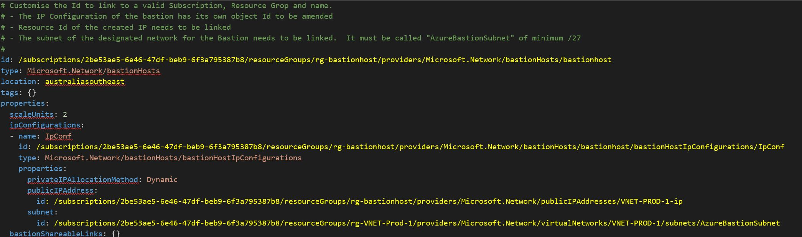

# Bastion Host 
Demonstrates the deployment of a Bastion against a specific subnet.

Requirements

1. Create a Public IP address for the Bastion
2. Customise and deploy the Bastion template.  The template is fundamentally a multi-honed appliance with a Public IP Address and a DHCP association to a private subnet. 



## *Example Install Script*

The example below demonstrates the deployment of YAML files into Azure.  

Note that Id entries for objects must be set prior to deployment.  Note the templates folder and subsequent Readme for further details.

```powershell
# Optional import of modules
# Import-Module "C:\Scripts\AZRest\1.0\powershell-yaml\0.4.2\powershell-yaml.psm1" 
# Import-Module "C:\Scripts\AZRest\1.0\AZRest\AZRest.psm1" 


# Get an authorised Azure Header for REST
$authHeader = Get-Header -scope "azure"  -Tenant "laurierhodes.info" -AppId "aa73b052-6cea-4f17-b54b-6a536be5c722" -secret 'XXXXXXXXXXXXXXXXXXXXXXXXX’ 

# Retrieve an up to date list of API versions (once per session) - note that any subscription may be used for generating a current API versions file.

if (!$AzAPIVersions){$AzAPIVersions = Get-AzureAPIVersions -header $authHeader -SubscriptionID "2be53ae5-6e46-47df-beb9-6f3a795387b8"}


# Create a Bastion

$path  = "C:\Scripts\yaml"
Get-Yamlfile -Path "$path\Bastion\PublicIP.yaml" | Push-Azureobject -AuthHeader $authHeader -Apiversions $AzAPIVersions 
Get-Yamlfile -Path "$path\Bastion\bastionhost.yaml" | Push-Azureobject -AuthHeader $authHeader -Apiversions $AzAPIVersions 


```


