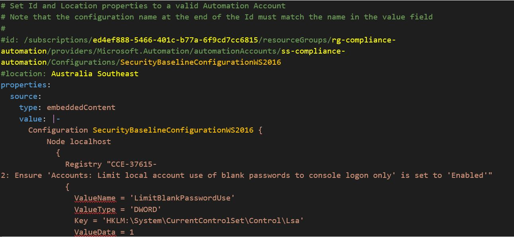

# DSC Template Installation
This example uses the default Microsoft Server 2016 DSC template as an example.  The example requires an Azure Automation 

## Customise YAML Templates

ID and Location properties need to be uncommented and customised.



Note that the configuration name at the end of the Id must match the name in the value field

## *Example Install Script*

```powershell

# Optional import of modules
# Install-Module -Name powershell-yaml
# Import-Module "C:\Scripts\AZRest\1.0\AZRest\AZRest.psm1" 

# Get an authorised Azure Header for REST
$authHeader = Get-Header -scope "azure"  -Tenant "laurierhodes.info" -AppId "aa73b052-6cea-4f17-b54b-6a536be5c722" -secret 'XXXXXXXXXXXXXXXXXXXXXXXXX’ 

# Retrieve an up to date list of API versions (once per session) - note that any subscription may be used for generating a current API versions file.

if (!$AzAPIVersions){$AzAPIVersions = Get-AzureAPIVersions -header $authHeader -SubscriptionID "2be53ae5-6e46-47df-beb9-6f3a795387b8"}


# Deploy a DSC configuration

Get-Yamlfile -Path "C:\Scripts\yaml\DSC\SecurityBaselineConfigurationWS2016.yaml" | Push-Azureobject -AuthHeader $authHeader -Apiversions $AzAPIVersions 

```


