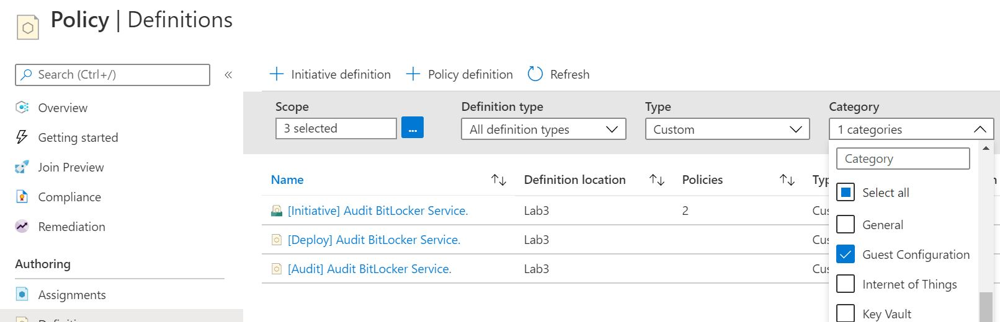

# Guest Configuration Policy
This example uses Microsoft's Audit Bitlocker example to demonstrate the Azure system component of adding Guest Configuration policies for Virtual Machines to the platform.

https://docs.microsoft.com/en-us/azure/governance/policy/how-to/guest-configuration-create

Guest Configuration reporting uses DSC MOF files that need to be retrieved from an accessible Storage Account.  The MOF & zip files from this example are included in the files section. 

The Guest Configuration is deployed as two Policies combined with an Initiative.  The 'DeployIfNotExists' policy contains connection details to the Storage Account holding the zipped DSC MOF.

## *Example Install Script*

```powershell

# Optional import of modules
# Install-Module -Name powershell-yaml
# Import-Module "C:\Scripts\AZRest\1.0\AZRest\AZRest.psm1" 

# Get an authorised Azure Header for REST
$authHeader = Get-Header -scope "azure"  -Tenant "laurierhodes.info" -AppId "aa73b052-6cea-4f17-b54b-6a536be5c722" -secret 'XXXXXXXXXXXXXXXXXXXXXXXXX’ 

# Retrieve an up to date list of API versions (once per session) - note that any subscription may be used for generating a current API versions file.

if (!$AzAPIVersions){$AzAPIVersions = Get-AzureAPIVersions -header $authHeader -SubscriptionID "2be53ae5-6e46-47df-beb9-6f3a795387b8"}


# Deploy a DSC configuration

Get-Yamlfile -Path "C:\Scripts\AuditBitLocker\AuditIfNotExists.yaml" | Push-Azureobject -AuthHeader $authHeader -Apiversions $AzAPIVersions 

Get-Yamlfile -Path "C:\Scripts\AuditBitLocker\DeployIfNotExists.yaml" | Push-Azureobject -AuthHeader $authHeader -Apiversions $AzAPIVersions 

Get-Yamlfile -Path "C:\Scripts\AuditBitLocker\Initiative.yaml" | Push-Azureobject -AuthHeader $authHeader -Apiversions $AzAPIVersions 

```

The templates and initiate can be seen within the Azure Portal.

