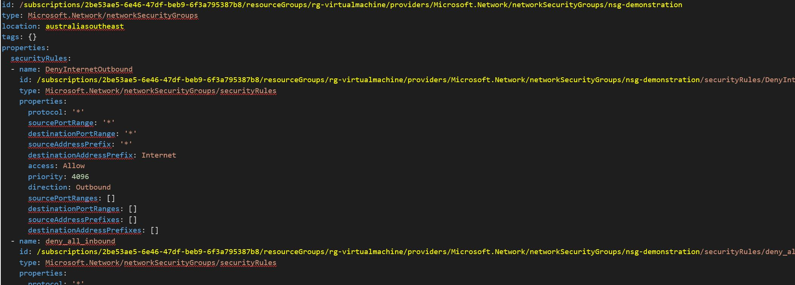

# Network Security Group Templates
This example template displays a complex Network Security Group set.  NSG rules have always been difficult to view and create programmatically with ARM templates.  YAML makes review and modification significantly easier.

NSG templates allow embedded Security Rule objects to be incorporated in the one template.  This requires a search and replace to nest the Id string on all SecurityRules objects. 

## Customise YAML Templates

ID and Location properties need to be uncommented and customised.



Of course Security Rules are unique for each environment!

## *Example Install Script*

```powershell

# Optional import of modules
# Install-Module -Name powershell-yaml
# Import-Module "C:\Scripts\AZRest\1.0\AZRest\AZRest.psm1" 

# Get an authorised Azure Header for REST
$authHeader = Get-Header -scope "azure"  -Tenant "laurierhodes.info" -AppId "aa73b052-6cea-4f17-b54b-6a536be5c722" -secret 'XXXXXXXXXXXXXXXXXXXXXXXXX’ 

# Retrieve an up to date list of API versions (once per session) - note that any subscription may be used for generating a current API versions file.

if (!$AzAPIVersions){$AzAPIVersions = Get-AzureAPIVersions -header $authHeader -SubscriptionID "2be53ae5-6e46-47df-beb9-6f3a795387b8"}


# Deploy a Network Security Group

Get-Yamlfile -Path "C:\Scripts\yaml\NetworkSecurityGroup\NetworkSecurityGroup.yaml" | Push-Azureobject -AuthHeader $authHeader -Apiversions $AzAPIVersions 

```


