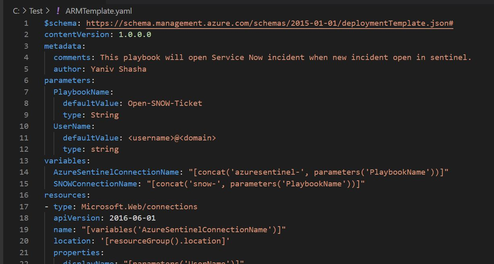

# Playbooks

The Playbooks in this directory are community contributed and forked from the Sentinel community site.  The convention is to develop ARM templates as Playbooks / Logic Apps.  

It would be a mistake to not use existing ARM resources with YAML. 



ARM Templates are deployed to their own dedicated 'deployment' Provider which can be managed with YAML like all other objects.

https://docs.microsoft.com/en-us/rest/api/resources/deployments/createorupdate#deploymentproperties

This allows ARM templates to be wrapped in YAML and deployed to the traditional ARM provider.

The community "Open-SNOW-Ticket" playbook has been converted into YAML with that template embedded within a standard 'deployment' object (which is shown below).

Note that a deployment object also has provision for directly setting parameters object values.  Online convertors sich as https://www.json2yaml.com/ may help in converting complex ARM templates with mixed quotes.

*Example of a converted ARM Template*

```yaml
id: /subscriptions/2be53ae5-6e46-47df-beb9-6f3a795387b8/resourceGroups/rg-logicapps/providers/Microsoft.Resources/deployments/my-deployment
properties:
  mode: Incremental
  parameters:
    UserName:
      value: "me@blackhole.org"
    PlaybookName:
      value: Open-SNOW-Ticket
  template:
    "$schema": https://schema.management.azure.com/schemas/2015-01-01/deploymentTemplate.json#
    contentVersion: 1.0.0.0
    metadata:
      comments: This playbook will open Service Now incident when new incident open in
        sentinel.
      author: Yaniv Shasha
    parameters:
      PlaybookName:
        defaultValue: Open-SNOW-Ticket
        type: String
      UserName:
        defaultValue: "<username>@<domain>"
        type: string
    variables:
      AzureSentinelConnectionName: "[concat('azuresentinel-', parameters('PlaybookName'))]"
      SNOWConnectionName: "[concat('snow-', parameters('PlaybookName'))]"
    resources:
    - type: Microsoft.Web/connections
      apiVersion: '2016-06-01'
      name: "[variables('AzureSentinelConnectionName')]"
```


//TODO - convert remaining Playbooks ;-)


## Example Install Script

```
# Optional import of modules
# Install-Module -Name powershell-yaml
# Import-Module "C:\Scripts\AZRest\1.0\AZRest\AZRest.psm1" 


# Get an authorised Azure Header for REST
$authHeader = Get-Header -scope "azure"  -Tenant "laurierhodes.info" -AppId "aa73b052-6cea-4f17-b54b-6a536be5c722" -secret 'XXXXXXXXXXXXXXXXXXXXXXXXX’ 


# Retrieve an up to date list of API versions (once per session) - note that any subscription may be used for generating a current API versions file.

if (!$AzAPIVersions){$AzAPIVersions = Get-AzureAPIVersions -header $authHeader -SubscriptionID "2be53ae5-6e46-47df-beb9-6f3a795387b8"}


# Deploy Playbook
$path  = "C:\Scripts\yaml"
Get-Yamlfile -Path "$path\Playbooks\Open-SNOW-Ticket.yaml" | Push-Azureobject -AuthHeader $authHeader -Apiversions $AzAPIVersions 


```

