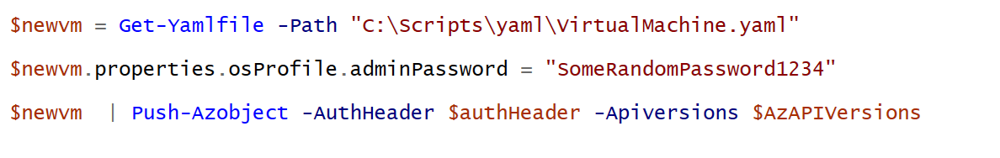

# Virtual Machine Provisioning 
Virtual Machines may be configured in an array of different ways which means its likely that most engineers will require a few sets at hand for customisation with different scenarios.

Virtual Machines are dependent upon a Network Interface being deployed and will most likely require multiple Extensions to be deployed after the Virtual Machine.  The Install sequence is likely to be:

1. Deploy NIC
2. Deploy VM
3. Deploy VM Extension #1
4. Deploy VM Extension #2

## *Example Install Script*

The example below demonstrates the deployment of YAML files into Azure.  

Note that Id entries for objects must be set prior to deployment.  Note the templates folder and subsequent Readme for further details.

```powershell
# Optional import of modules
# Import-Module "C:\Scripts\AZRest\1.0\powershell-yaml\0.4.2\powershell-yaml.psm1" 
# Import-Module "C:\Scripts\AZRest\1.0\AZRest\AZRest.psm1" 


# Get an authorised Azure Header for REST
$authHeader = Get-Header -scope "azure"  -Tenant "laurierhodes.info" -AppId "aa73b052-6cea-4f17-b54b-6a536be5c722" -secret 'XXXXXXXXXXXXXXXXXXXXXXXXX’ 

# Retrieve an up to date list of API versions (once per session) - note that any subscription may be used for generating a current API versions file.

if (!$AzAPIVersions){$AzAPIVersions = Get-AzureAPIVersions -header $authHeader -SubscriptionID "2be53ae5-6e46-47df-beb9-6f3a795387b8"}


# Create a Virtual Machine

$path  = "C:\Scripts\yaml"
Get-Yamlfile -Path "$path\VM\NetworkInterface.yaml" | Push-Azureobject -AuthHeader $authHeader -Apiversions $AzAPIVersions 
Get-Yamlfile -Path "$path\VM\VirtualMachine.yaml" | Push-Azureobject -AuthHeader $authHeader -Apiversions $AzAPIVersions 
Get-Yamlfile -Path "$path\VM\Extension-OMSAgent.yaml" | Push-Azureobject -AuthHeader $authHeader -Apiversions $AzAPIVersions 

```

Most organisations will require a method for managing default passwords that are not in plain text (which YAML requires).  This is easily addressed because all objects are translated to PowerShell objects prior to deployment.  As every property is able to be set, passwords can be retrieved from any particular vault or may be retrieved at runtime.

*Example of setting password during deployment*



The complete set of Virtual Machine Properties may be reviewed with Microsoft documentation

https://docs.microsoft.com/en-us/rest/api/compute/virtualmachines/createorupdate

