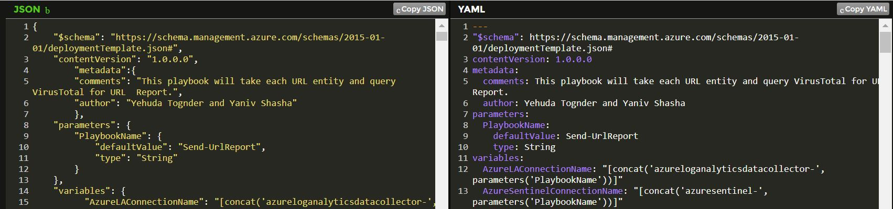
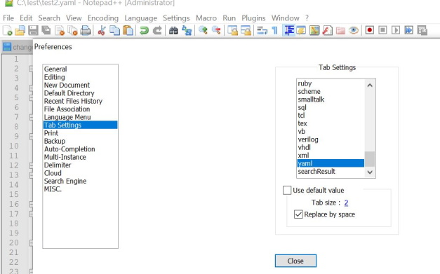
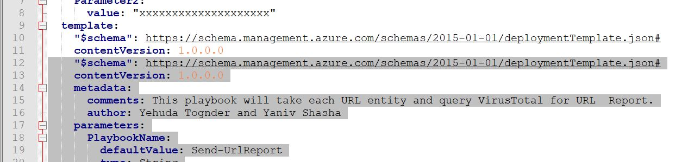

# YAML / ARM wrapper

Azure Resource Manager templates are JSON templates submitted by REST API to one particular provider:

*/providers/Microsoft.Resources/deployments/*

Ultimately all Azure API calls are made in JSON.  The use of YAML is just a simple translation of the same JSON notation.  

Online services such as https://www.json2yaml.com/ can convert existing JSON templates into yaml 



The converted ARM template can be copied and pasted into a "nested" template.  

## Wrapper YAML Template

An example of the 'wrapper' of a YAML converted template is represented below (and included in this directory):

```yaml

id: /subscriptions/ce4e3d23-f7e6-4dc0-81af-c135e4ddaf3e/resourceGroups/my-rgname/providers/Microsoft.Resources/deployments/my-deployment
properties:
  mode: Incremental
  parameters:
    Parameter1:
      value: "xxxxxxxxxxxxxxxxxxxx"
    Parameter2:
      value: "xxxxxxxxxxxxxxxxxxxx"
  template:
    "$schema": https://schema.management.azure.com/schemas/2015-01-01/deploymentTemplate.json#
    contentVersion: 1.0.0.0
```

Don't forget that YAML uses spaces (either two or four) for indentation.  The pasted / converted yaml has to align with (and replace) the schema and contentversion elements in the provided template.

Notepad++ is a free editor that supports YAML compliant indenting.  Under settings, the default use of "tabs" with the tab button can be replaced with spaces.  I'm using two spaces for indenting.



By keeping the converted ARM yaml highlighted - it can be "tabbed" in with Notepad++ to step in the extra 4 spaces needed to wrap the template for use with the deployments provider.



When the YAML is aligned the duplicate "$schema" and "contentVersion" lines can be removed.

The final conversion task is to rename the Parameters at the top of the template to match whatever is included within the template (as in the parameter names etc)