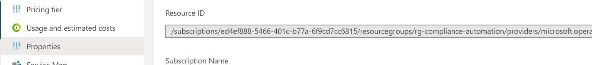
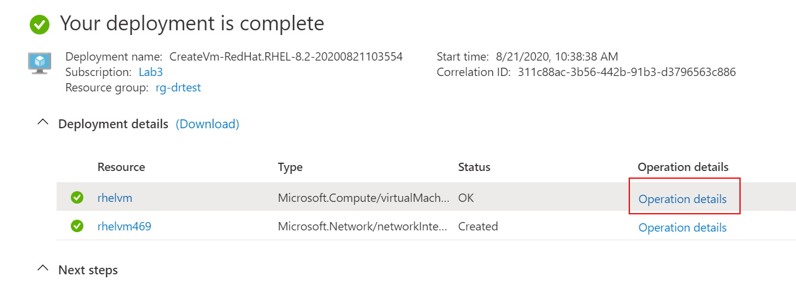
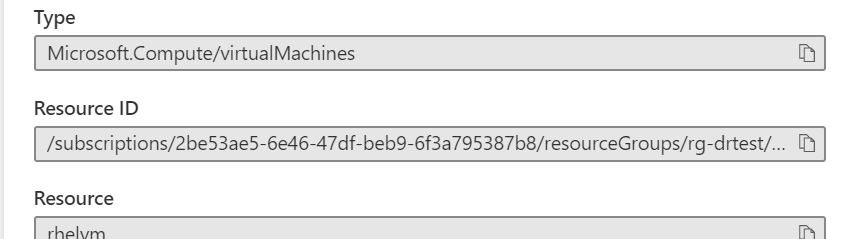
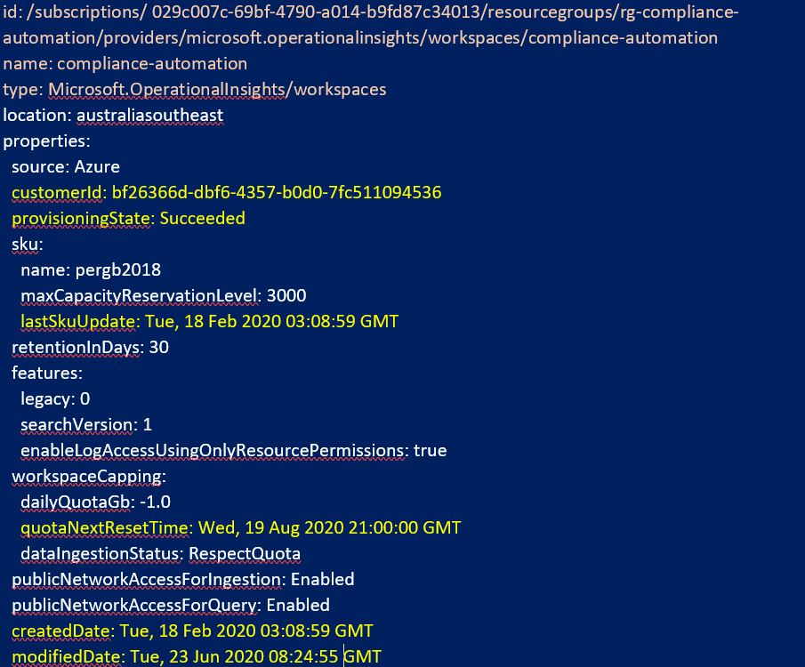

# Convert Azure Object to YAML

Most Azure objects will have a visible Id in the console.  This Id can be used for retrieving the visible properties of the object and writing them to YAML locally.




Converting a portal deployed object can be an easy way to generate an initial template for generating YAML templates.  At the completion of every GUI based portal deployment, the Azure Portal displays a deployment completion message with operation details.



The Operation details list the Resource IDs of every object that has ben provisioned in the solution which makes it easy to retrieve copies of each object from the cloud.




## Example Retrieval Script

An example of the script is below.

```powershell

Import-Module "C:\Scripts\AZRest\1.0\AZRest\AZRest.psm1" 
Import-Module "C:\Scripts\\powershell-yaml\0.4.2\powershell-yaml.psm1" 

# Get an authorised Azure Header
$authHeader = Get-Header -scope "azure"  -Tenant "laurierhodes.info" -AppId "aa73b052-6cea-4f17-b54b-6a536be5c715" `
                         -secret 'XXXXXXXXXXXXXXXXXXXXXXXXXXXXXXXXXX'

# Retrieve an up to date list of namespace versions (once per session)
if (!$AzAPIVersions){$AzAPIVersions = Get-AzureAPIVersions -header $authHeader -SubscriptionID "2be53ae5-6e46-47df-beb9-6f3a795387b8"}

# Specify the Id to be retrieved
$id="/subscriptions/ed4ef888-5466-401c-b77a-6f9cd7cc6815/resourcegroups/rg-compliance-automation/providers/microsoft.operationalinsights/workspaces/compliance-automation"

$object = $null
$object = Get-Azureobject -AuthHeader $authHeader -apiversions $AzAPIVersions -id $id

Out-File -FilePath "C:\Test\deploy.yaml" -InputObject (ConvertTo-Yaml -data $object) -Force 
```

**Be aware that not all Azure objects may be provisioned on the basis of what they look like after they have been deployed!**

However, retrieving objects, in conjunction with Microsoft's API documentation https://docs.microsoft.com/en-us/rest/api/azure/ can be a great place to start with customising a deployable object.

## Example - Cleanup

With the example above a number of metadata fields can be removed such as etag, lastSkuUpdate, ProvisioningState, CreatedDate, Modified date etc.  



Also notice that 'Name' and 'Type' which are common properties of all Azure objects form part of the Id string.  As long as you are declaring the Id, you don't need these properties either.

What properties are writable can always be referenced in Microsoft's documentation:

 Microsoft's API documentation https://docs.microsoft.com/en-us/rest/api/azure/ 

