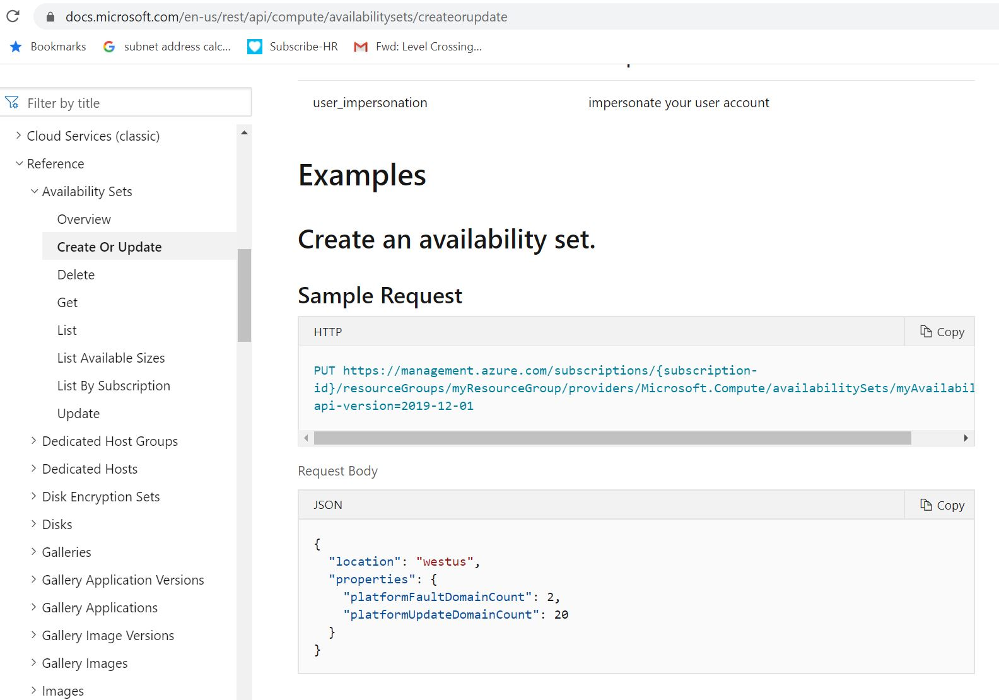
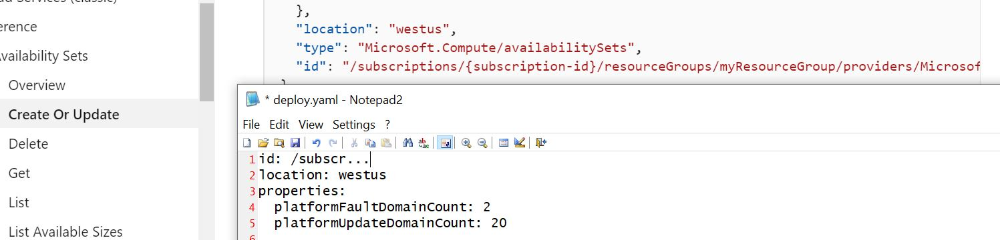

# Convert 'Microsoft Examples'

Microsoft's REST API documentation is well maintained with REST payload examples for all of its providers.https://docs.microsoft.com/en-us/rest/api/azure/

One method for creating YAML templates is to convert JSON from the documentation examples and adding an Id string to the output.  



With any example the body can be copied and pasted into the associated PowerShell script.

```powershell
# Example - Convert Microsoft documentation to YAML

$json = @'
{
	"location": "westus",
	"properties": {
		"platformFaultDomainCount": 2,
		"platformUpdateDomainCount": 20
	}
}
'@

$object = convertfrom-json -InputObject $json

Out-File -FilePath "C:\Test\deploy.yaml" -InputObject (ConvertTo-Yaml -data $object) -Force 
```

**Note** that Microsoft's documentation will always have an example response which will contain an example Id field.  This may be added to the YAML template for easy customisation in the future.




The resultant YAML template may be commented for alteration and deployment.

```yaml
# Edit the Availability Set and Location details for this service
#
#id: /subscriptions/{subscription-id}/resourceGroups/{ResourceGroup}/providers/Microsoft.Compute/availabilitySets/{AvailabilitySetName}
#location: westus
properties:
  platformFaultDomainCount: 2
  platformUpdateDomainCount: 20
```

The script may be downloaded below.

 [ConvertExamples.ps1](ConvertExamples.ps1) 